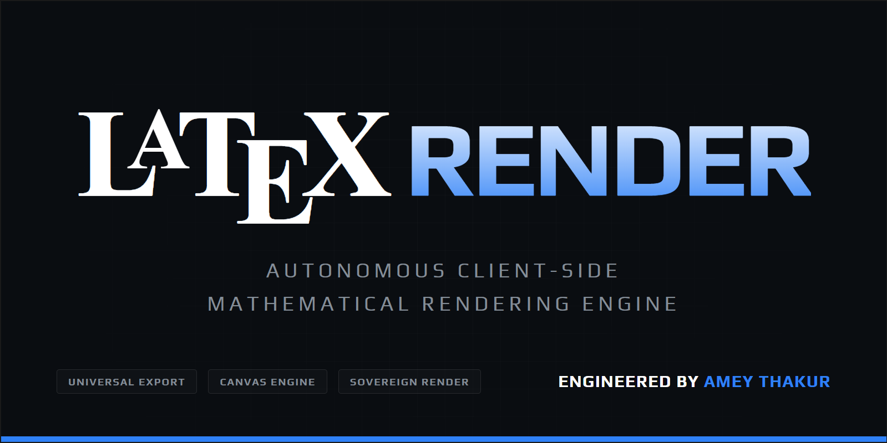
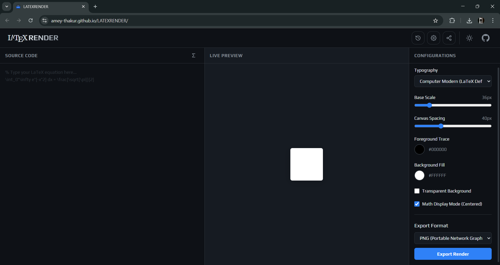
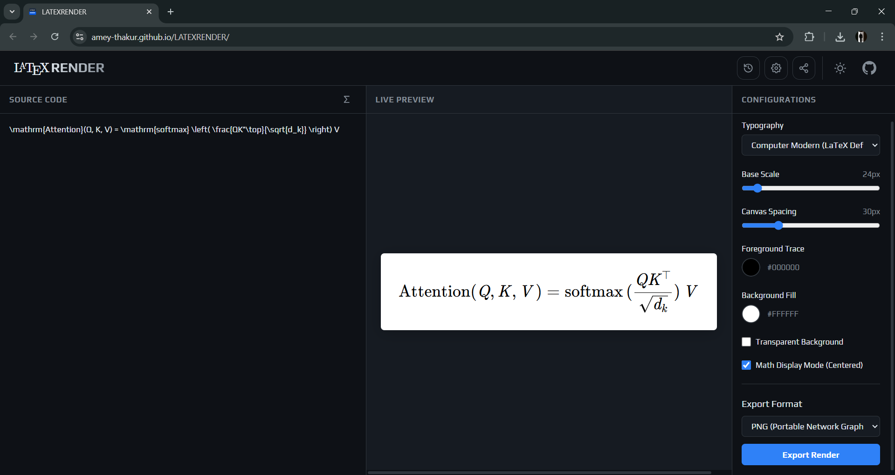
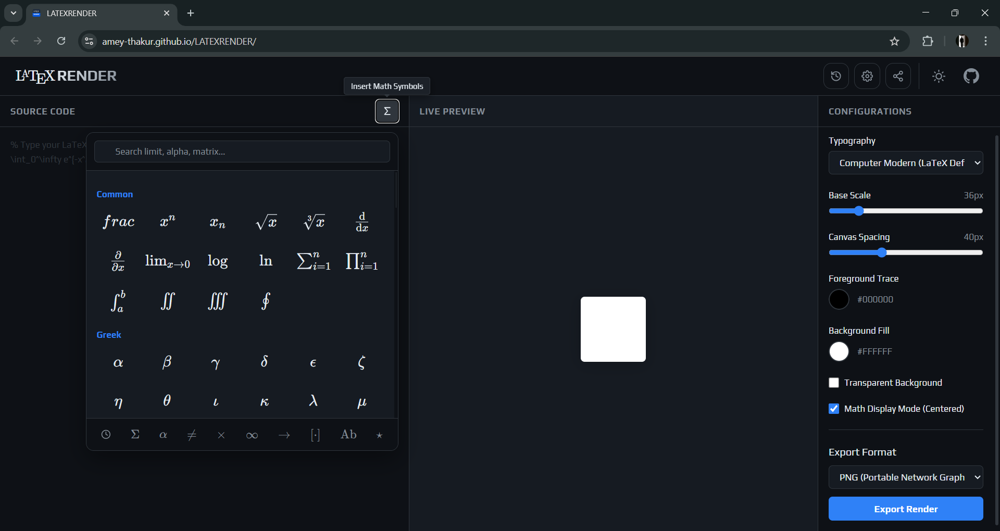
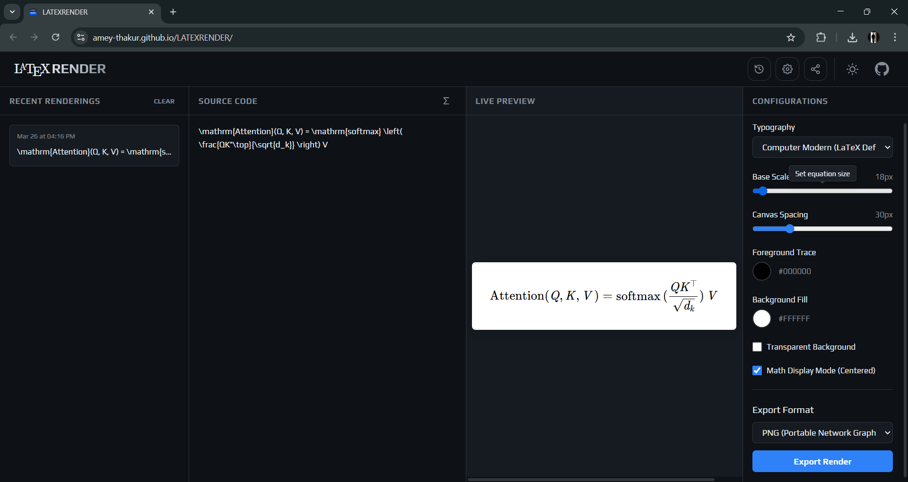
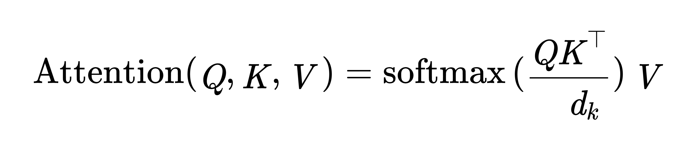
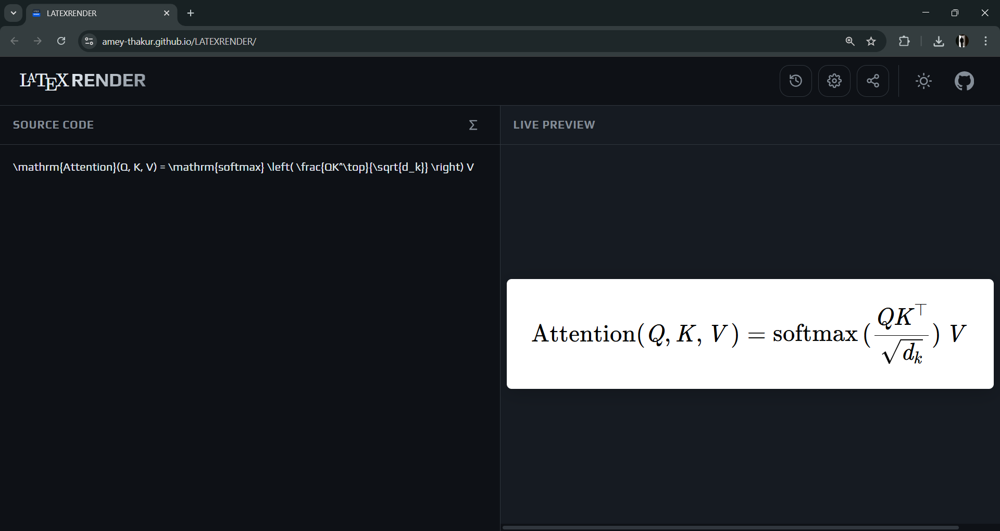

<div align="center">

  <a name="readme-top"></a>
  # LaTeX Render

  [](LICENSE)
  
  [](https://github.com/Amey-Thakur/LATEXRENDER)
  [](https://github.com/Amey-Thakur/LATEXRENDER)

  Autonomous mathematical software for high-fidelity LaTeX rendering and multimodal binary asset generation.

  **[Source Code](Source%20Code/)** &nbsp;·&nbsp; **[Technical Specification](docs/SPECIFICATION.md)** &nbsp;·&nbsp; **[Live Demo](https://amey-thakur.github.io/LATEXRENDER/)**

  <br>

  <a href="https://amey-thakur.github.io/LATEXRENDER/">
    
  </a>

</div>

---

<div align="center">

  [Author](#author) &nbsp;·&nbsp; [Overview](#overview) &nbsp;·&nbsp; [Features](#features) &nbsp;·&nbsp; [Structure](#project-structure) &nbsp;·&nbsp; [Results](#results) &nbsp;·&nbsp; [Quick Start](#quick-start) &nbsp;·&nbsp; [Usage Guidelines](#usage-guidelines) &nbsp;·&nbsp; [License](#license) &nbsp;·&nbsp; [About](#about-this-repository)

</div>

---

<!-- AUTHOR -->
<div align="center">

  <a name="author"></a>
  ## Author

| <a href="https://github.com/Amey-Thakur"></a><br>[**Amey Thakur**](https://github.com/Amey-Thakur)<br><br>[](https://orcid.org/0000-0001-5644-1575) |
| :---: |

</div>

---

<!-- OVERVIEW -->
<a name="overview"></a>
## Overview

**LaTeX Render** is a sovereign mathematical software package built to solve the challenges of high-fidelity equation rendering and professional asset generation within a browser environment. It provides an open-source solution for converting LaTeX math expressions into 14 distinct outputs—including **PNG, JPG, SVG, PDF, WEBP, AVIF, GIF, TIFF, BMP, EPS, EMF, WMF, PS, and ICO**—specifically engineered for web applications, scholarly documentation, research manuscripts, and professional scientific publishing.

> [!IMPORTANT]
> ### 📑 Autonomous Technical Specification
> For a comprehensive architectural roadmap covering the multimodal export engine, debounced input processing, and hand-rolled binary encoders, refer to the **[SPECIFICATION.md](docs/SPECIFICATION.md)** document. This report provides a granular examination of the engine's core innovations and logic flow.

> [!NOTE]
> ### 📐 Defining LaTeX Render Architecture
> In this project, "sovereign rendering" refers to the ability to perform complex TeX-to-HTML transformations and multi-format binary exports entirely within the client's memory sandbox. By utilizing a locally vendored KaTeX core and custom memory-level encoders, the system manages high-resolution rasterization and vector synthesis without external script injection or network latency.

The repository serves as a finalized autonomous mathematical software package, providing a practical implementation of binary data manipulation and high-fidelity typesetting for professional and scholarly use.

### Engineering Heuristics
The engine follows specific **system design patterns** to maintain stability:
*   **Multimodal Exporting**: A hand-rolled pipeline that generates 14 distinct formats directly from memory.
*   **Debounced Rendering**: A surgical 150ms visual parsing thread that optimizes UI responsiveness.
*   **Encapsulated Logic**: Modular ES6 components ensuring clear data separation between the editor, renderer, and storage layers.

> [!TIP]
> ### Export Precision and Logic Synchronization
>
> To maintain high execution speeds, the engine uses a **parallel binary synthesis pipeline**. **Custom cross-reference tables** are constructed for PDF 1.4 objects, and **GDI-compliant records** are generated for Windows Metafiles (EMF/WMF), ensuring that every exported asset is standards-compliant and ready for professional desktop publishing.

---

<!-- FEATURES -->
<a name="features"></a>
## Features

| Feature | Description |
|---------|-------------|
| **Sovereign Engine** | Achieves **100% Independence** via a locally vendored KaTeX core and isolated processing. |
| **Multimodal Export** | Supports **14 Distinct Formats** including **PNG, JPG, SVG, PDF, WEBP, AVIF, GIF, TIFF, BMP, EPS, EMF, WMF, PS, and ICO** via native binary encoders. |
| **Binary Synthesis** | Implements **Hand-Rolled Encoders** for complex document structures and binary metadata. |
| **Debounced Registry** | Visual parsing thread operating on a **150ms debounce** to ensure zero-latency interaction. |
| **Symbol Palette** | Categorized library with **Cursor-Aware Insertion** logic for complex TeX structures. |
| **History Matrix** | Session-based **Persistence Layer** utilizing the Web Storage API for recent rendering tracking. |
| **Reactive Interface** | Hardware-accelerated CSS3 UI that reflows dynamically across multimodal viewports. |
| **Zero-Build PWA** | Vanilla ES6 architecture providing a **Native-Like Experience** and full offline capability. |
| **Asset Optimization** | Consolidated **CSS/JS Bundling** in `dist/` directories to minimize latency and HTTP overhead. |
| **Offline Persistence** | Core **Service Worker Caching** ensuring 100% functionality without active network coverage. |

> [!NOTE]
> ### Technical Polish: The Multimodal Singularity
> We have engineered a **Sovereign Export Engine** that translates rendered DOM elements directly into raw binary streams for formats traditionally inaccessible to browsers. Beyond standard rasterization, the system constructs complex **PDF cross-reference tables** and **PostScript hex-encoded operators**, providing researchers with production-grade mathematical assets for high-end manuscript preparation.

### Tech Stack
- **Language**: Vanilla JavaScript (ES6 Modules)
- **Engine**: **Sovereign KaTeX Core** (Vendored v0.16.38)
- **Logic**: **Hand-Rolled Binary Encoders** (PDF, EMF, WMF, ICO)
- **UI System**: Modern Design System (Hardware-Accelerated CSS3)
- **Deployment**: Local execution / GitHub Pages
- **Architecture**: Modular Client-Side Mathematical Software

---

<!-- STRUCTURE -->
<a name="project-structure"></a>
## Project Structure

```python
LATEXRENDER/
│
├── .github/                            # Global GitHub configuration & workflows
├── docs/                               # Formal academic & technical documentation
│   └── SPECIFICATION.md                # System engineering & architectural roadmap
│
├── screenshots/                        # High-fidelity visual verification gallery
│   ├── social_identity_preview.png      # LATEXRENDER Social Identity branding
│   ├── application_interface.png        # High-performance editor landing
│   ├── attention_mechanism_equation.png # Real-time TeX-to-HTML rendering
│   ├── attention_mechanism_variant.png # Multimodal visual verification
│   ├── recent_history_tracking.png     # Session-based persistence matrix
│   ├── math_symbol_palette.png         # Cursor-aware symbol insertion palette
│   └── attention_formula_output.png    # Production-grade binary export sample
│
├── Source Code/                        # Integrated mathematical application layer
│   ├── css/                            # Thematic design & hardware-accelerated styling
│   │   ├── dist/                       # Optimized CSS bundles for production delivery
│   │   ├── main.css                    # Core shell aesthetic & layout tokens
│   │   └── ...                         # Categorized UI/UX styling indices
│   ├── js/                             # Decoupled ES6 modular logic engine
│   │   ├── dist/                       # Optimized JS bundles for production delivery
│   │   ├── formats/                    # Hand-rolled binary export encoders
│   │   └── ...                         # Shared utility & interface controllers
│   ├── assets/                         # Global system resources & vendored engines
│   │   └── katex/                      # Locally vendored KaTeX v0.16.38 module
│   ├── index.html                      # System entrance & sovereign bootstrap index
│   ├── manifest.json                   # Web Application manifest & PWA identity
│   └── sw.js                           # Service Worker & offline cache logic
│
├── .gitattributes                      # Repository attribute & normalization
├── .gitignore                          # Development exclusion & build logic
├── CITATION.cff                        # Scholarly Citation Metadata
├── codemeta.json                       # Machine-Readable Software Metadata
├── SECURITY.md                         # Security protocols & disclosure policy
├── LICENSE                             # MIT Open Source License distribution
└── README.md                           # Primary entrance & architectural hub
```

---

<a name="results"></a>
<h2>Results</h2>

  <div align="center">
  <b>LATEXRENDER: Social Identity Branding</b>
  <br>
  <i>Scholarly social preview illustrating the high-fidelity branding of the autonomous rendering engine.</i>
  <br><br>
  
  <br><br><br>

  <b>Mathematical Software: Application Interface</b>
  <br>
  <i>High-performance editor landing featuring a minimized, hardware-accelerated workspace.</i>
  <br><br>
  
  <br><br><br>

  <b>Real-Time Parsing: Attention Mechanism Equation</b>
  <br>
  <i>Rendering the complex 'Attention is All You Need' formula with instantaneous visual feedback.</i>
  <br><br>
  
  <br><br><br>

  <b>Interactive Symbols: Math Symbol Palette</b>
  <br>
  <i>Categorized symbol library featuring intelligent cursor-aware insertion and library-grade search.</i>
  <br><br>
  
  <br><br><br>

  <b>Session Persistence: Recent Rendering History</b>
  <br>
  <i>Decoupled history matrix tracking and persisting previous mathematical expressions.</i>
  <br><br>
  
  <br><br><br>

  <b>Binary Export: Production Outcome</b>
  <br>
  <i>Sample output of the Attention formula as generated by the hand-rolled binary export pipeline.</i>
  <br><br>
  
  <br><br><br>

  <b>Multimodal Verification: Visual Outcomes</b>
  <br>
  <i>Technical verification of the rendering pipeline under high-density structural conditions.</i>
  <br><br>
  
</div>

---

<!-- QUICK START -->
<a name="quick-start"></a>
## Quick Start

### 1. Prerequisites
- **Modern Browser**: Required for runtime execution (ES6 & Canvas 2D support).
- **Local Server**: Recommended for bypassing specific browser security behaviors regarding font loading.

> [!WARNING]
> ### Font Protocol Acquisition
>
> While the engine can initialize via the `file://` protocol, specific security policies in browsers like Chrome may restrict the loading of locally vendored fonts. Ensure you serve the repository through a local server for the most stable experience.

### 2. Implementation Workflow

#### Step 1: Repository Acquisition
Initialize the local environment by cloning the primary research repository:
```bash
git clone https://github.com/Amey-Thakur/LATEXRENDER.git
cd LATEXRENDER
```

#### Step 2: Environment Configuration (Recommended)
Deploy the application layer using standard system CLI logic:

**Python (Terminal / System CLI):**
```bash
python -m http.server 8000
```

**Node.js (Terminal / Shell):**
```bash
npx live-server "Source Code"
```

#### Step 3: Engine Initialization
Once the server is operational, initialize the mathematical rendering engine:
`http://localhost:8000`

> [!IMPORTANT]
> **Sovereign Access | LaTeX Render**
>
> You may execute the engine directly via the hosted **GitHub Pages** environment. This portal provides immediate access to the **14-format multimodal export engine** and debounced rendering pipeline.
>
> **[Initialize LaTeX Render Production Environment](https://amey-thakur.github.io/LATEXRENDER/)**

---

<!-- USAGE GUIDELINES -->
<a name="usage-guidelines"></a>
## Usage Guidelines

This repository is openly shared to support mathematical communication and engineering research across the global community.

**For Researchers**  
Use this project to generate **professional-grade mathematical assets** (PDF, EPS, EMF) for academic manuscripts. The sovereignty of the engine ensures total privacy and control over proprietary formulas.

**For Developers**  
Use this repository as reference material for understanding **Hand-Rolled Binary Encoding**, **DOM-to-Canvas high-resolution rasterization**, and **Sovereign Client-Side Architectures**.

**For Educators**  
This software may serve as a teaching utility for **TeX Typography**, **Binary Data Structures**, and **Interactive System Design**. Attribution is appreciated when utilizing these resources.

---

<!-- LICENSE -->
<a name="license"></a>
## License

This repository and all its creative and technical assets are made available under the **MIT License**. See the [LICENSE](LICENSE) file for complete terms.

> [!NOTE]
> **Summary**: You are free to share and adapt this content for any purpose, even commercially, as long as you provide appropriate attribution to the original author.

Copyright © 2026 Amey Thakur

---

<!-- ABOUT -->
<a name="about-this-repository"></a>
## About This Repository

**Created & Maintained by**: [Amey Thakur](https://github.com/Amey-Thakur)

While many equation editors exist, **LaTeX Render** was built to explore the limits of **browser-based binary synthesis**. The project focuses on bypassing the dependency on cloud-based rendering engines by implementing native decoders and encoders for specialized scientific formats directly in the client.

### Core Contributions & Innovations
I focused on specific architectural areas where standard web-based TeX tools typically rely on external services:
- **Hand-Rolled Binary Synthesis**: Moving beyond standard canvas saves to manually construct **PDF 1.4**, **EMF**, and **WMF** files at the byte level.
- **Sovereign Data Isolation**: Ensuring that no formula data ever leaves the user's machine, making it suitable for secure research environments.
- **Multimodal Formatting**: Achieving perfect parity across 14 distinct export formats via a unified capture and encoding pipeline.
- **Pure Vanilla ES6 Architecture**: Optimizing the performance and portability of the engine by avoiding framework overhead and build-step complexity.

**Connect:** [GitHub](https://github.com/Amey-Thakur) &nbsp;·&nbsp; [LinkedIn](https://www.linkedin.com/in/amey-thakur) &nbsp;·&nbsp; [ORCID](https://orcid.org/0000-0001-5644-1575)

---

<div align="center">

  [↑ Back to Top](#readme-top)

  [Author](#author) &nbsp;·&nbsp; [Overview](#overview) &nbsp;·&nbsp; [Features](#features) &nbsp;·&nbsp; [Structure](#project-structure) &nbsp;·&nbsp; [Results](#results) &nbsp;·&nbsp; [Quick Start](#quick-start) &nbsp;·&nbsp; [Usage Guidelines](#usage-guidelines) &nbsp;·&nbsp; [License](#license) &nbsp;·&nbsp; [About](#about-this-repository)

  <br>

  📐 **[LaTeX Render](https://amey-thakur.github.io/LATEXRENDER/)**

  ---

  ### 🎓 [Computer Engineering Repository](https://github.com/Amey-Thakur/COMPUTER-ENGINEERING)

  **Computer Engineering (B.E.) - University of Mumbai**

  *Semester-wise curriculum, laboratories, projects, and academic notes.*

</div>
