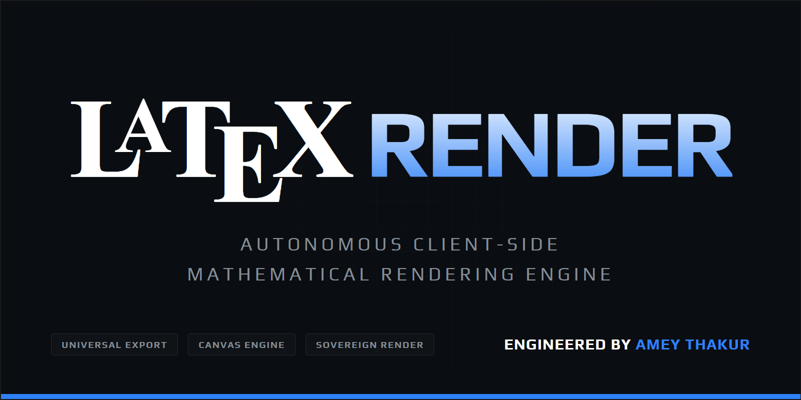
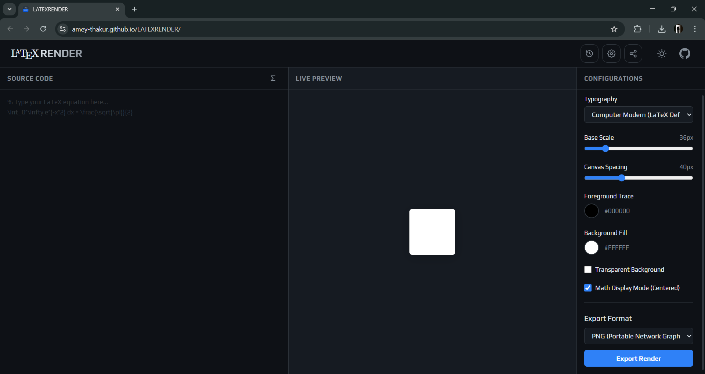
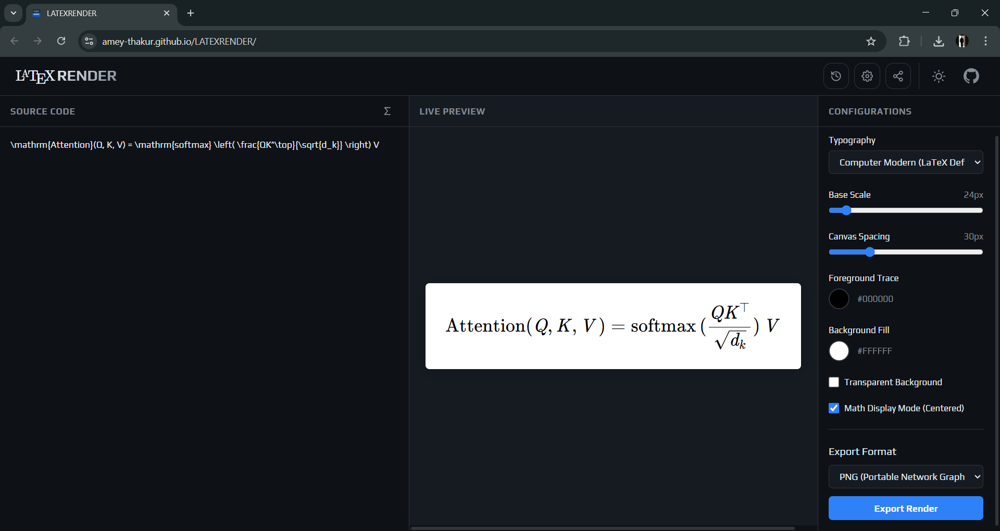
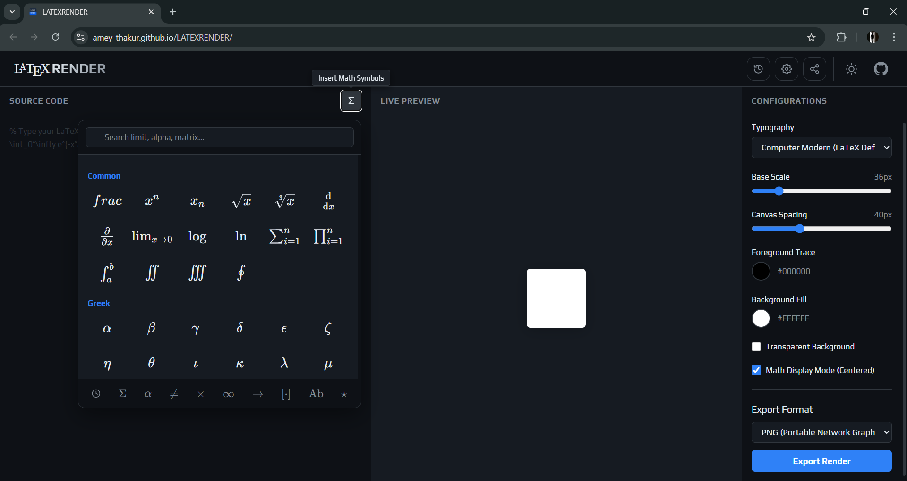
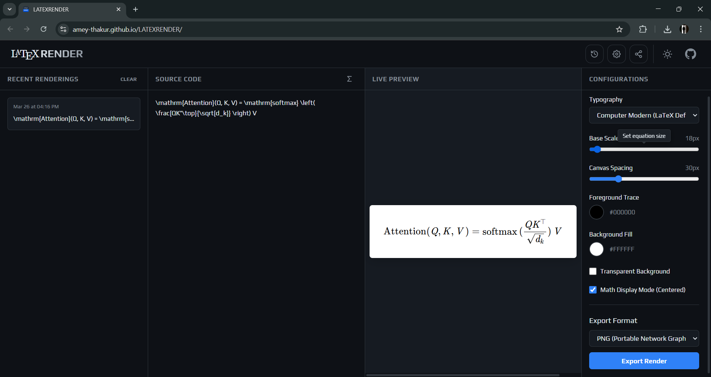
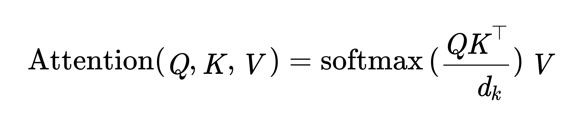
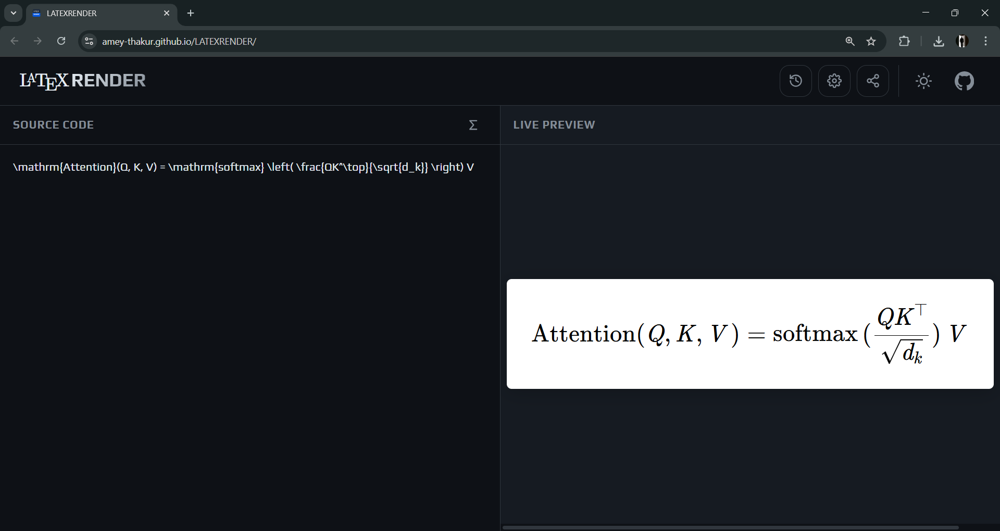

<div align="center">

  # <a href="https://amey-thakur.github.io/LATEXRENDER/"></a> LaTeX Render

  [](LICENSE)
  
  [](https://github.com/Amey-Thakur/LATEXRENDER)
  [](https://github.com/Amey-Thakur/LATEXRENDER)

  A LaTeX equation editor that runs entirely in the browser and exports to fourteen formats, with no server and no network.

  **[Source Code](Source%20Code/)** &nbsp;·&nbsp; **[Technical Specification](docs/SPECIFICATION.md)** &nbsp;·&nbsp; **[Live Demo](https://amey-thakur.github.io/LATEXRENDER/)**

  <br>

  <a href="https://amey-thakur.github.io/LATEXRENDER/">
    
  </a>

</div>

---

<div align="center">

  [Author](#author) &nbsp;·&nbsp; [Overview](#overview) &nbsp;·&nbsp; [Features](#features) &nbsp;·&nbsp; [Structure](#project-structure) &nbsp;·&nbsp; [Results](#results) &nbsp;·&nbsp; [Quick Start](#quick-start) &nbsp;·&nbsp; [Usage Guidelines](#usage-guidelines) &nbsp;·&nbsp; [License](#license) &nbsp;·&nbsp; [About](#about-this-repository)

</div>

---

<!-- AUTHOR -->
<div align="center">

  <a name="author"></a>
  ## Author

| <a href="https://github.com/Amey-Thakur"></a><br>[**Amey Thakur**](https://github.com/Amey-Thakur)<br><br>[](https://orcid.org/0000-0001-5644-1575) |
| :---: |

</div>

---

<!-- OVERVIEW -->
<a name="overview"></a>
## Overview

**LaTeX Render** turns a LaTeX expression into a publication-ready image without leaving the page. Everything happens on the client: parsing, typesetting, and the encoding of every output format. It converts LaTeX math into 14 outputs, including **PNG, JPG, SVG, PDF, WEBP, AVIF, GIF, TIFF, BMP, EPS, EMF, WMF, PS, and ICO, engineered for web applications, scholarly documentation, research manuscripts, and professional scientific publishing.

> [!IMPORTANT]
> ### <a href="https://amey-thakur.github.io/LATEXRENDER/"></a> Technical specification
> [SPECIFICATION.md](docs/SPECIFICATION.md) covers the export engine, the input handling, and the binary encoders in detail.

> [!NOTE]
> ### <a href="https://amey-thakur.github.io/LATEXRENDER/"></a> What runs where
> Nothing is sent anywhere. KaTeX is vendored into the repository rather than loaded from a CDN, and every export format is encoded in JavaScript against a canvas or a byte buffer. The consequence worth knowing: once the page has loaded once, it works with the network off.

The result is a finished tool rather than a demonstration: it is installable, it works offline, and the formats it writes open in the applications that expect them.

### Design decisions
*   **Every format is written by hand.** PNG and JPEG come from a canvas, but PDF, EPS, PostScript, ICO, EMF and WMF are assembled byte by byte, because no browser offers them.
*   **Rendering is debounced.** Typing does not trigger a re-render on every keystroke, which keeps a long expression responsive.
*   **One concern per file.** The editor, renderer, exporter, history and layout are separate modules that share nothing but the DOM.

> [!TIP]
> ### On the binary formats
>
> PDF output builds its own cross-reference table so the file opens in a reader rather than merely carrying the extension. EMF and WMF are emitted as GDI records, which is what lets a Windows document embed the equation as a vector rather than a bitmap.

---

<!-- FEATURES -->
<a name="features"></a>
## Features

| Feature | Description |
|---------|-------------|
| **No dependencies at runtime** | KaTeX is vendored into the repository. Nothing is fetched from a CDN and nothing is sent to a server. |
| **Fourteen export formats** | PNG, JPG, WEBP, AVIF, GIF, BMP, TIFF, SVG, PDF, EPS, PS, ICO, EMF and WMF, each encoded in the browser. |
| **Hand-written encoders** | PDF cross-reference tables, PostScript operators and GDI metafile records are assembled directly, because no browser API produces them. |
| **Symbol palette** | 183 symbols across ten categories, searchable, inserted at the cursor with the caret placed inside the structure. |
| **Adjustable workspace** | Drag the dividers to resize the editor, preview and settings, or switch between a side-by-side and a stacked layout. The arrangement is remembered. |
| **History** | Recent expressions are kept in local storage and can be restored or cleared. |
| **Responsive** | One layout from a 320px phone to a desktop, with larger controls on touch screens. |
| **Works offline** | A service worker caches the application after the first visit, while still picking up new releases. |
| **Accessible** | Every control carries an accessible name, the palette reports its open state, and the splitters can be driven from the keyboard. |

> [!NOTE]
> ### Why the formats are the hard part
> A browser will hand you a PNG from a canvas and little else. Everything past that is bytes you write yourself: a PDF needs a valid object table, an ICO needs a directory of images, and a WMF needs records a 1990s graphics layer will accept. That is where most of this codebase lives.

### Tech Stack
- **Language**: JavaScript (ES6), no framework and no build dependencies
- **Typesetting**: KaTeX, vendored into the repository
- **Exports**: Canvas rasterisation, plus encoders written for PDF, EPS, PS, ICO, EMF and WMF
- **Interface**: CSS with custom properties, light and dark themes
- **Offline**: Service worker, network-first for the application and cache-first for assets
- **Build**: `scripts/build_bundles.py`, standard library only
- **Deployment**: GitHub Pages, from `Source Code/`

---

<!-- STRUCTURE -->
<a name="project-structure"></a>
## Project Structure

```python
LATEXRENDER/
│
├── .github/                             # Global GitHub configuration & workflows
├── docs/                                # Formal academic & technical documentation
│   └── SPECIFICATION.md                 # System engineering & architectural roadmap
│
├── screenshots/                         # Gallery used by this README
│   ├── social_identity_preview.png      # LATEXRENDER Social Identity branding
│   ├── application_interface.png        # High-performance editor landing
│   ├── attention_mechanism_equation.png # Real-time TeX-to-HTML rendering
│   ├── attention_mechanism_variant.png  # Multimodal visual verification
│   ├── recent_history_tracking.png      # Session-based persistence matrix
│   ├── math_symbol_palette.png          # Cursor-aware symbol insertion palette
│   └── attention_formula_output.png     # Production-grade binary export sample
│
├── Source Code/                         # Integrated mathematical application layer
│   ├── css/                             # Styles, one file per area of the interface
│   │   ├── dist/                        # Built bundle the page loads (see scripts/)
│   │   ├── main.css                     # Core shell aesthetic & layout tokens
│   │   └── ...                          # Categorized UI/UX styling indices
│   ├── js/                              # Application modules, plain scripts sharing globals
│   │   ├── dist/                        # Built bundle the page loads (see scripts/)
│   │   ├── formats/                     # Binary encoders: raster, vector, document, icon, metafile
│   │   └── ...                          # Editor, renderer, exporter, layout, history, palette
│   ├── assets/screenshots/              # Images used by the application and its manifest
│   ├── vendor/katex/                    # Vendored KaTeX, with its fonts
│   ├── 404.html                         # Pages fallback
│   ├── index.html                       # Application entry point
│   ├── manifest.json                    # Web Application manifest & PWA identity
│   └── sw.js                            # Service Worker & offline cache logic
│
├── scripts/                             # Build tooling
│   └── build_bundles.py                 # Rebuilds the dist bundles, stamps the service worker
│
├── .gitattributes                       # Repository attribute & normalization
├── .gitignore                           # Development exclusion & build logic
├── CITATION.cff                         # Scholarly Citation Metadata
├── codemeta.json                        # Machine-Readable Software Metadata
├── SECURITY.md                          # Security protocols & disclosure policy
├── LICENSE                              # MIT Open Source License distribution
└── README.md                            # Primary entrance & architectural hub
```

---

<a name="results"></a>
<h2>Results</h2>

  <div align="center">
  <b>LATEXRENDER: Social Identity Branding</b>
  <br>
  <i>The social preview card.</i>
  <br><br>
  
  <br><br><br>

  <b>Mathematical Software: Application Interface</b>
  <br>
  <i>High-performance editor landing featuring a minimized, hardware-accelerated workspace.</i>
  <br><br>
  
  <br><br><br>

  <b>Real-Time Parsing: Attention Mechanism Equation</b>
  <br>
  <i>Rendering the complex 'Attention is All You Need' formula with instantaneous visual feedback.</i>
  <br><br>
  
  <br><br><br>

  <b>Interactive Symbols: Math Symbol Palette</b>
  <br>
  <i>Categorized symbol library featuring intelligent cursor-aware insertion and library-grade search.</i>
  <br><br>
  
  <br><br><br>

  <b>Session Persistence: Recent Rendering History</b>
  <br>
  <i>Decoupled history matrix tracking and persisting previous mathematical expressions.</i>
  <br><br>
  
  <br><br><br>

  <b>Binary Export: Production Outcome</b>
  <br>
  <i>Sample output of the Attention formula as generated by the hand-rolled binary export pipeline.</i>
  <br><br>
  
  <br><br><br>

  <b>Multimodal Verification: Visual Outcomes</b>
  <br>
  <i>Technical verification of the rendering pipeline under high-density structural conditions.</i>
  <br><br>
  
</div>

---

<!-- QUICK START -->
<a name="quick-start"></a>
## Quick Start

### 1. Prerequisites
- **Modern Browser**: Required for runtime execution (ES6 & Canvas 2D support).
- **Local Server**: Recommended for bypassing specific browser security behaviors regarding font loading.

> [!WARNING]
> ### Font Protocol Acquisition
>
> While the engine can initialize via the `file://` protocol, specific security policies in browsers like Chrome may restrict the loading of locally vendored fonts. Ensure you serve the repository through a local server for the most stable experience.

### 2. Implementation Workflow

#### Step 1: Repository Acquisition
Initialize the local environment by cloning the primary research repository:
```bash
git clone https://github.com/Amey-Thakur/LATEXRENDER.git
cd LATEXRENDER
```

#### Step 2: Environment Configuration (Recommended)
Deploy the application layer using standard system CLI logic:

**Python (Terminal / System CLI):**
```bash
python -m http.server 8000 --directory "Source Code"
```

**Node.js (Terminal / Shell):**
```bash
npx live-server "Source Code"
```

> [!NOTE]
> The application root is `Source Code`, which is also what the deployment
> workflow publishes. Serving the repository root instead returns a directory
> listing rather than the engine.

#### Step 3: Engine Initialization
Once the server is operational, initialize the mathematical rendering engine:
`http://localhost:8000`

> [!IMPORTANT]
> **Run it without installing anything**
>
> You may execute the engine directly via the hosted **GitHub Pages** environment. This portal provides immediate access to the **14-format multimodal export engine** and debounced rendering pipeline.
>
> **[Initialize LaTeX Render Production Environment](https://amey-thakur.github.io/LATEXRENDER/)**

#### Step 4: Rebuilding After a Source Change

The browser loads `css/dist/bundle.css` and `js/dist/bundle.js`. The files under
`css/` and `js/` are the sources those bundles are composed from, so an edit to
a source reaches the application only once the bundles are rebuilt:

```bash
python scripts/build_bundles.py
```

The same script stamps the service worker's cache identifier from a hash of the
built output, which is what makes a returning visitor receive the new release
rather than the copy their browser cached. The deployment workflow runs
`python scripts/build_bundles.py --check` and fails if a bundle is out of date,
so a stale build cannot ship.

---

<!-- USAGE GUIDELINES -->
<a name="usage-guidelines"></a>
## Usage Guidelines

This repository is openly shared to support mathematical communication and engineering research across the global community.

**For Researchers**  
Use it to produce equation assets (PDF, EPS, EMF) for manuscripts. Because nothing leaves the browser, it also means total privacy and control over proprietary formulas.

**For Developers**  
Use this repository as reference material for understanding **writing binary formats by hand**, **DOM-to-canvas rasterisation at high resolution**, and **applications that run entirely on the client**.

**For Educators**  
This software may serve as a teaching utility for **TeX Typography**, **Binary Data Structures**, and **Interactive System Design**. Attribution is appreciated when utilizing these resources.

---

<!-- LICENSE -->
<a name="license"></a>
## License

This repository and all its creative and technical assets are made available under the **MIT License**. See the [LICENSE](LICENSE) file for complete terms.

> [!NOTE]
> **Summary**: You are free to share and adapt this content for any purpose, even commercially, as long as you provide appropriate attribution to the original author.

Copyright © 2026 Amey Thakur

---

<!-- ABOUT -->
<a name="about-this-repository"></a>
## About This Repository

**Created & Maintained by**: [Amey Thakur](https://github.com/Amey-Thakur)

While many equation editors exist, **LaTeX Render** was built to explore the limits of **browser-based binary synthesis**. The project focuses on bypassing the dependency on cloud-based rendering engines by implementing native decoders and encoders for specialized scientific formats directly in the client.

### Core Contributions & Innovations
I focused on specific architectural areas where standard web-based TeX tools typically rely on external services:
- **Hand-Rolled Binary Synthesis**: Moving beyond standard canvas saves to manually construct **PDF 1.4**, **EMF**, and **WMF** files at the byte level.
- **No data leaves the machine**: nothing is uploaded, which makes it usable on work that cannot be sent to a third party.
- **Multimodal Formatting**: Achieving perfect parity across 14 distinct export formats via a unified capture and encoding pipeline.
- **Pure Vanilla ES6 Architecture**: Optimizing the performance and portability of the engine by avoiding framework overhead and build-step complexity.

**Connect:** [GitHub](https://github.com/Amey-Thakur) &nbsp;·&nbsp; [LinkedIn](https://www.linkedin.com/in/amey-thakur) &nbsp;·&nbsp; [ORCID](https://orcid.org/0000-0001-5644-1575)

---

<div align="center">

  [↑ Back to Top](#-latex-render)

  [Author](#author) &nbsp;·&nbsp; [Overview](#overview) &nbsp;·&nbsp; [Features](#features) &nbsp;·&nbsp; [Structure](#project-structure) &nbsp;·&nbsp; [Results](#results) &nbsp;·&nbsp; [Quick Start](#quick-start) &nbsp;·&nbsp; [Usage Guidelines](#usage-guidelines) &nbsp;·&nbsp; [License](#license) &nbsp;·&nbsp; [About](#about-this-repository)

  <br>

  <a href="https://amey-thakur.github.io/LATEXRENDER/"></a> **[LaTeX Render](https://amey-thakur.github.io/LATEXRENDER/)**

  ---

  ### 🎓 [Computer Engineering Repository](https://github.com/Amey-Thakur/COMPUTER-ENGINEERING)

  **Computer Engineering (B.E.) - University of Mumbai**

  *Semester-wise curriculum, laboratories, projects, and academic notes.*

</div>

