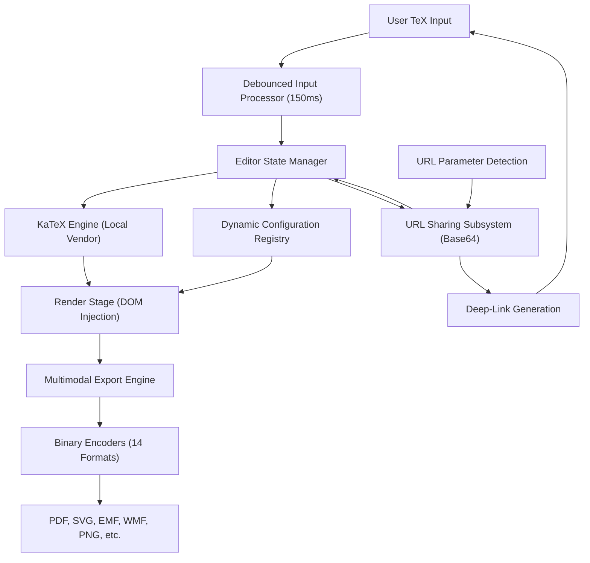

# Technical Specification: LaTeX Render Engine

## Architectural Overview

**LaTeX Render** is a high-performance, autonomous mathematical software package designed for sovereign client-side rendering. The architecture achieves 100% independence from external networks and third-party CDNs by utilizing a locally vendored KaTeX core. It provides a specialized, future-proof environment for TeX-to-HTML transformation and multi-format binary exports without any build-tool dependencies.

### Structural Data Flow

---

## Technical Implementations

### 1. Engine Architecture
-   **Sovereign Rendering Architecture**: Implements a strictly compartmentalized environment where all TeX parsing and HTML generation occur within the client's memory sandbox. This guarantees 100% data isolation and continuous operation regardless of external service availability.
-   **Vendored Mathematical Core**: Utilizes a customized, locally-stored version of the KaTeX library for $O(1)$ startup latency and deterministic rendering outcomes across different browsers.

### 2. Logic & Synchronization
-   **Debounced Rendering Subsystem**: Integrates a surgical 150-millisecond debounce block on the editor's input stream. This optimizes the rendering loop, ensuring UI responsiveness even when processing complex multiline mathematical equations.
-   **Observable State Management**: Employs an event-driven synchronization model where the Editor, Settings, and History modules communicate through established callback registries, maintaining a unified application state without global variable pollution.
-   **URL-Based Formula Persistence**: Implements a serialized sharing subsystem that encodes active LaTeX expressions into **Base64** strings within the URL's query parameters (`?formula=`). This enables portable, state-preserving deep-links that can be shared across academic and research environments.
-   **Automatic Deep-Link Initialization**: The application logic includes a boot-sequence detection routine that identifies encoded formulas in the URL on startup. It automatically decodes, validates, and injects the formula into the Editor context during the initialization phase, bypassing the need for manual input.

### 3. Multimodal Export Engine
-   **Universal Binary Encoders**: Features a 100% dependency-free export pipeline supporting 14 distinct outputs. It utilizes custom-written, hand-rolled binary encoders for structured document formats including **PDF 1.4**, Windows Metafiles (**EMF**, **WMF**), and Icon files (**ICO**), as well as raster and vector payloads.
-   **Precision Memory Management**: Directly manipulates `Uint8Array` buffers and `ArrayBuffer` objects to construct standards-compliant binary headers and cross-reference tables (e.g., PDF `xref` segments) for lossless file generation.

### 4. Interface & Interaction
-   **Sovereign UI Matrix**: The interface leverages hardware-accelerated CSS3 animations and hardware-optimized layout reflows. The responsive viewport dynamically prioritizes the rendering stage based on pixel-density and aspect-ratio detection.
-   **Intelligent Symbol Palette**: Provides a categorized, searchable LaTeX symbol library with intelligent "Cursor-Aware Insertion." The logic anticipates the necessary cursor placement within complex structures like fractions (`\frac{ }{ }`) and matrices to accelerate mathematical authoring.

### 5. Scholarly Branding & CI/CD
-   **Authorship Integration**: Consists of standardized, scholarly authorship headers embedded across 35 foundational source files. This ensures professional attribution and repository integrity in academic and engineering environments.
-   **Automated CI/CD Pipeline**: Implements a specialized GitHub Actions workflow that auto-binds the `/Source Code` directory to GitHub Pages on every `main` branch push, ensuring the live application is always synchronized with the stable source.

---

## Technical Prerequisites

-   **Runtime Environment**: Modern Evergreen Browser with support for ES6 Modules, Canvas 2D API, Web Storage, and the native TextEncoder API.
-   **Deployment Model**: Pure vanilla deployment; requires zero package managers (npm/yarn) or transpilation steps.

---

*Technical Specification | Autonomous Mathematical Rendering Engine | Version 1.0*
